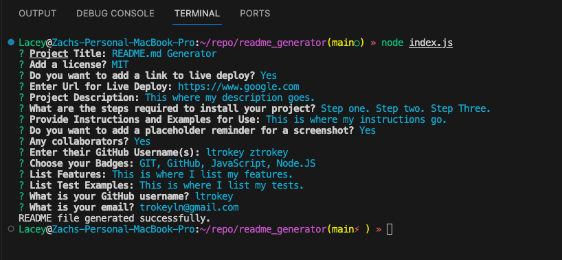

# README.md Generator

[Link to Video Presentation](https://drive.google.com/file/d/1dro_wzTio81h6SQ5K0gei3kplWYXiIIm/view)

## Description
The project is a Node.js-based command-line application designed to streamline the creation of well-structured README files for software projects. It utilizes the 'inquirer' package to prompt users with a series of questions, allowing them to input key project details, including the project's title, license, description, installation instructions, usage examples, and more. Users can also choose to add live deployment links, badges, and even collaborate by specifying GitHub usernames. The application generates a professionally formatted README file, which serves as an essential documentation and introduction for the project, helping developers and users understand its purpose, features, and how to use it effectively.

## Table of Contents
- [Installation](#installation)
- [Usage](#usage)
- [Badges](#badges)
- [Features](#features)
- [Questions](#questions)

## Installation
1. Install `npm`
2. Install `npm i inquirer@8.2.4`

## Usage

**Start the Application:**
Launch the README generator by running the following command in your terminal: `node index.js`

**Answer the Questions:**
The application will prompt you with a series of questions about your project. Answer each question to provide information about your project, including its title, license, description, installation steps, usage instructions, badges, collaborators, features, and more.

**Generate the README:**
Once you've answered all the questions, the application will generate a README file based on your input. The generated README file will be named 'README.md' and will be saved in the project directory.

**Review the Generated README:**
Open the 'README.md' file to review the generated README content. It will include all the information you provided, neatly formatted in Markdown. You can make any additional edits or refinements to the generated README if needed.

**Use the README:**
The generated README can now be included in your project's repository. It serves as a useful documentation and introduction for your project, helping others understand its purpose, features, and how to use it effectively.

## Badges

## Features
- Interactive Command-Line Interface: The project provides an interactive command-line interface that guides users through the process of creating a README.

- Project Information: Users can input project details such as the title, description, and license.

- License Selection: The project allows users to select a license from a list of common open-source licenses.

- Live Deployment Link: Users can provide a live deployment link for their project, if applicable.

- Badge Selection: The generator offers the option to include badges (e.g., GitHub, JavaScript, Node.js) for the README.

- Collaborator Information: Users can specify GitHub usernames of project collaborators.

- Customization: The generator provides the ability to customize the README's structure, including sections for features, tests, and additional user-defined sections.

- Automatic Table of Contents: The generator can automatically create a table of contents for the README based on the sections added.

- Markdown Formatting: The generator ensures proper Markdown formatting for headers, lists, code blocks, and links.

- Validation and Error Handling: The application checks for errors in the input data and guides the user to provide complete and valid information.

- Command-Line Parameters: Users have the option to pass parameters through the command line to pre-fill certain sections of the README.

## Questions
[GitHub Profile](https://github.com/ltrokey)

Please feel free to contact me via the email link below.

[Email](mailto:trokeyln@gmail.com)
